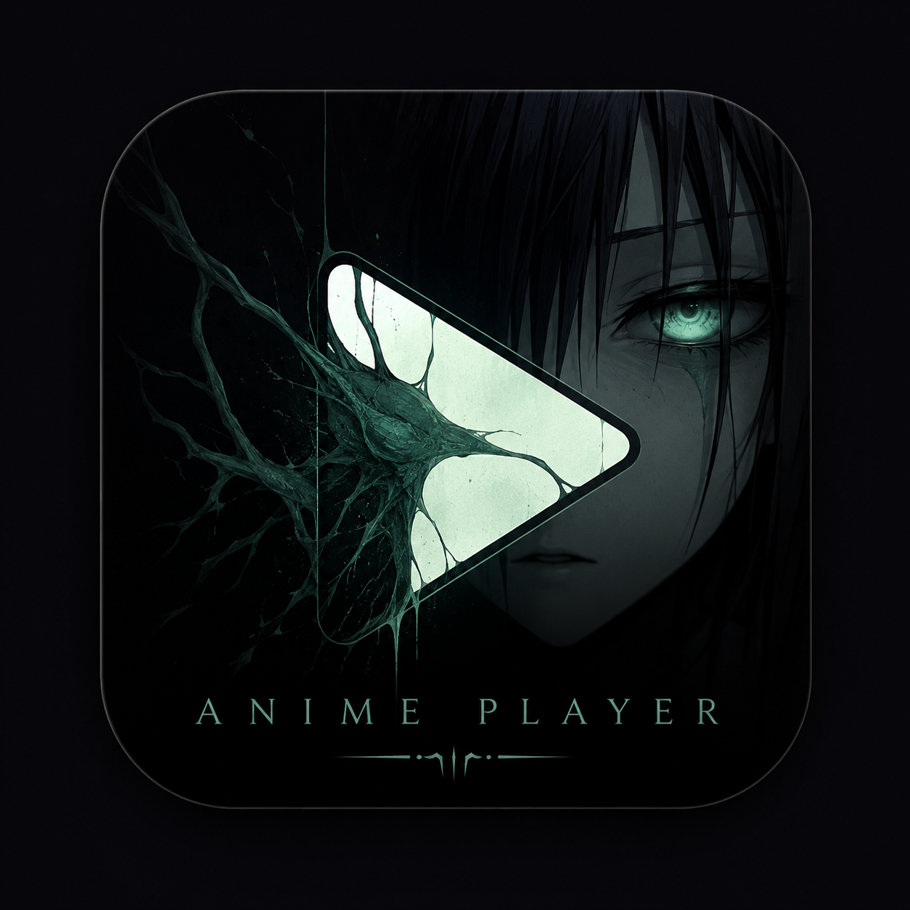

<div align="center">



# KAGEUTA

**Seu player de anime favorito, agora no desktop.**

Versão C++ nativa — leve, rápido, sem dependência de Python.

[](https://isocpp.org/)
[](https://www.qt.io/)
[](https://cmake.org/)

---

</div>

## Sobre

Kageuta é um player de anime para Windows com interface moderna e escura. Versão C++ nativa usando Qt6 para máxima performance e menor tamanho.

## Funcionalidades

- **Interface escura e estilizada** com tema teal
- **Catálogo completo** do Animes Online (legendados e dublados)
- **Busca por animes** diretamente no app
- **Player integrado** com controles completos
- **Alternância entre fontes** (dublado / legendado)
- **Controles de mídia**: play/pause, volume, seek

## Compilar

### Pré-requisitos

- [MSYS2](https://www.msys2.org/) com MinGW-w64
- GCC, CMake, Qt6, libcurl

### Instalar dependências (MSYS2)

```bash
pacman -S mingw-w64-x86_64-gcc mingw-w64-x86_64-cmake mingw-w64-x86_64-make \
          mingw-w64-x86_64-qt6-base mingw-w64-x86_64-qt6-svg mingw-w64-x86_64-qt6-multimedia \
          mingw-w64-x86_64-curl mingw-w64-x86_64-nlohmann-json
```

### Compilar

```bash
# Dentro do MSYS2 MinGW64
cd Kageuta-Cpp
mkdir build && cd build
cmake .. -G "MinGW Makefiles" -DCMAKE_BUILD_TYPE=Release
cmake --build .
```

Ou execute `build.bat` no Windows.

## Tamanho

| Componente | Tamanho |
|------------|---------|
| Executável | ~2 MB |
| DLLs Qt | ~30 MB |
| **Total** | **~55 MB** |

## Estrutura

```
Kageuta-Cpp/
├── assets/
│   ├── icon.png
│   └── resources.qrc
├── src/
│   ├── main.cpp
│   ├── mainwindow.h/cpp
│   ├── scraper.h/cpp
│   ├── player.h/cpp
│   ├── clickableframe.h
│   └── styles.h
├── CMakeLists.txt
└── build.bat
```

## Tecnologias

| Tecnologia | Uso |
|------------|-----|
| **C++17** | Linguagem |
| **Qt6** | Interface gráfica |
| **Qt6 Multimedia** | Player de vídeo |
| **libcurl** | HTTP requests |
| **CMake** | Build system |

## Licença

MIT
